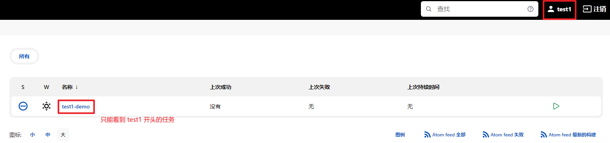
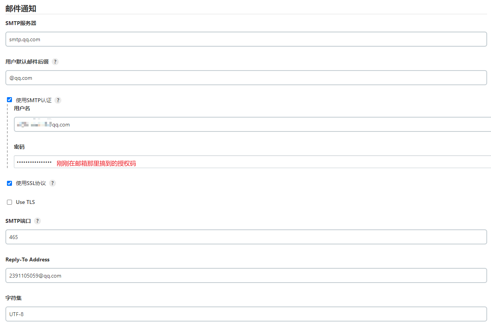
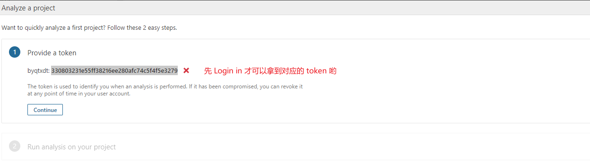
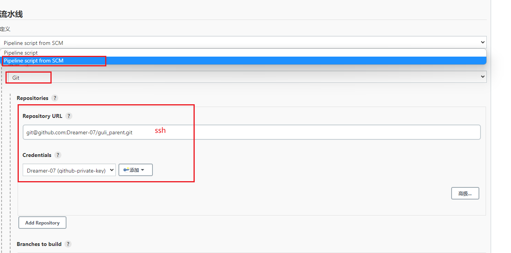
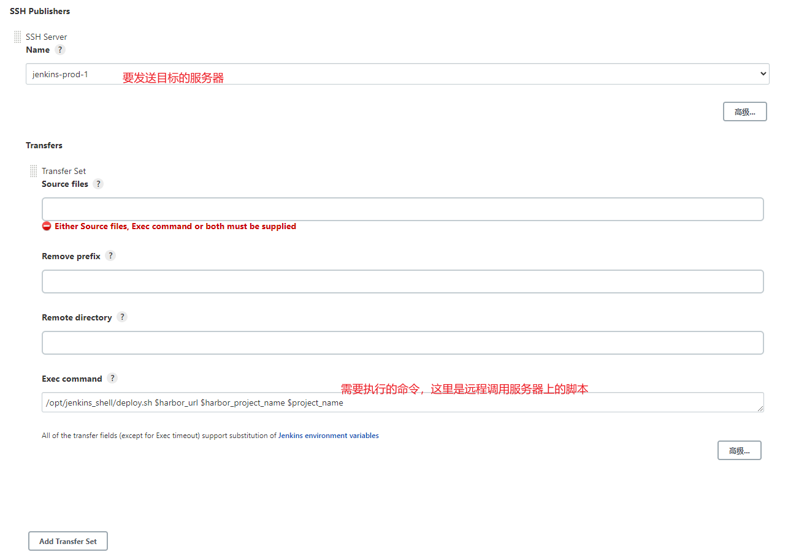
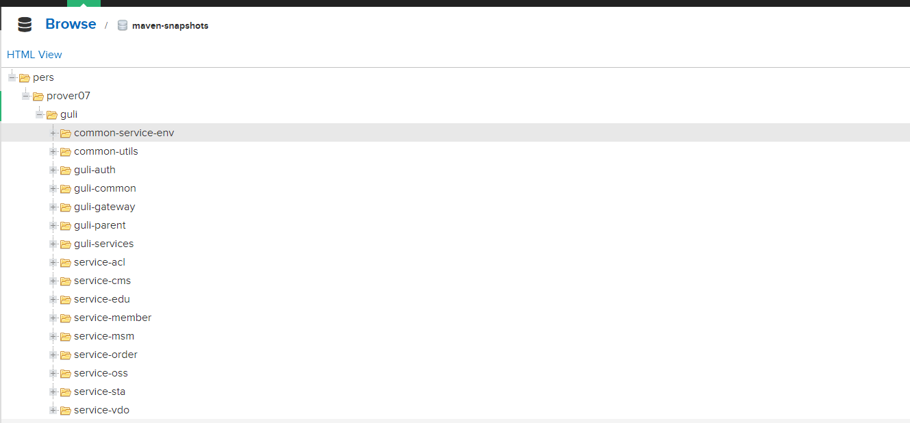

# Jenkins 持续集成

## 持续集成及Jenkins介绍

### 软件开发生命周期

软件开发生命周期又叫做 SDLC, 它是集合了计划，开发，测试和部署过程的集合，如下图所示


- 需求分析：根据项目需求，执行一个可行性计划的分析，这阶段主要是对项目信息的收集，分析项目的预算，以及收益情况，明确项目创建的目标
- 设计：主要是设计系统的架构和整个系统最后出来需要什么功能
- 实现：开发者根据任务和在设计阶段确定的目标进行代码开发
- 测试：包括功能测试，代码测试，压力测试等
- 进化(维护)：对产品不断的进行改进和维护，根据用户的使用情况和反馈，可能需要对某功能进行修改，bug修复，功能增加等

### 软件开发瀑布模型


| 优势                                 | 劣势                                                         |
| ------------------------------------ | ------------------------------------------------------------ |
| 简单易用和理解                       | 每个阶段都是固定的，会产出大量的文档，增加工作量             |
| 当完成一个阶段之后，只用关注后续阶段 | 由于开发模型是线性的，用户只有等到最后才能看到产品的最终效果，增加了成本和风险 |
| 为项目提供了按阶段划分的检查节点     | 最核心的劣势在于 **无法快速适应用户提出需求的变化**          |

### 软件敏捷开发

> 什么是敏捷开发？

敏捷开发(Agile Develop) 的核心是**迭代开发**与**增量开发**

- 迭代开发：对于大型软件项目，传统的开发方式是采用一个大周期进行开发，整个过程就是一次大开发

  迭代开发的方式则不一样，它将开发过程拆分成多个小周期，即将一次 **大开发** 拆分成 **多次小开发**，每次小开发都是一样的流程

- 增量开发：软件的每个版本，都会新增一个用户可以感知的完整功能，也就是说，按照**新增功能来划分迭代版本**

> 敏捷开发如何迭代？

虽然敏捷开发分成多个迭代，但是也要求，每次迭代都是一个**完整的软件开发周期**


> 敏捷开发的好处

- 早期交付：降低成本
- 降低风险：可以即使了解市场需求，降低产品不适用的风险

### 持续集成

> 敏捷开发的好搭档

持续集成(CI)指的是，频繁的(一天多次)将代码集成到主干

持续集成的目的就是：**让产品可以快速迭代，同时还能保证高质量**；核心措施就是代码集成到主干后，必须通过自动化测试，只要有一个测试用例失败，就不能集成

> 持续集成的流程

- 提交：流程的第一步，开发者想代码仓库提交代码
- 测试(第一轮)：代码仓库对 commit 操作配置了钩子(hook), 只要代码提交或者合并到主干，就会进行自动化测试
- 构建：通过第一轮测试后，代码就可以合并到主干，就算可以交付了。而构建指的是，**将源码转为可以运行的实际代码**(例如安装依赖，配置各种资源等等)
- 测试(第二轮)：构建之后，如果第一轮已经覆盖了所有测试内容，第二轮就可以省略，当前，这时构建步骤就需要移动到第一轮测试前面
- 部署：通过第二轮测试，当前代码就是一个可以直接部署的版本，将这个版本的所有文件打包存档，发送生产服务器
- 回滚(支持自动回滚)：一旦当前版本发生问题，就要回滚到上一个版本的构建结果

> 持续集成的组成要素

- 一个**自动构建过程**，从构建代码，编译构建，运行测试，结果记录，测试统计都是自动完成的，无需人工干预
- 一个**代码存储库**，即需要版本控制软件来保证代码的可维护性，同时作为构建过程的素材库，一般使用 SVN / GIT
- 一个**持续集成服务器**，而 **Jenkins** 就是一个配置简单和使用方便持续集成服务器

> 持续集成的好处

1. 降低风险，由于持续集成会自动的不断的进行构建，编译和测试；可以很早期的发现问题，减小修复的代价
2. 对系统健康持续检查，减少发布风险带来的问题
3. 减少重复性的工作
4. **持续部署**，提供可部署单元包
5. 持续交付可供使用的版本

### Jenkins 介绍


官网：https://www.jenkins.io/zh/

简介：是一款流行的开源的**持续集成(CI)工具**,广泛用于项目开发，具有自动化构建，测试和部署等功能

特征：


## Jenkins 安装和持续集成环境配置

### 持续集成流程说明


1. 开发人员进行 commit 将代码提交到 git 仓库
2. Jenkins 作为持续集成工具，使用 git 工具到 git 仓库拉取代码到集成服务器，再配合 JDK, Maven 等软件完成代码编译，代码测试，审查，打包等工作；(在这个过程中每一步出错，都重新执行一次整个流程)
3. Jenkins 将打包的 war / jar 包分发到测试服务器/生产服务器，供测试人员/用户访问

### Gitlab 代码托管仓库服务器

#### 安装

1. 安装相关依赖

   ```bash
   yum -y install policycoreutils openssh-server openssh-clients postfix
   ```

2. 启动 ssh 服务 & 并设置开机自启

   ```bash
   systemctl enable sshd && sudo systemctl start sshd
   ```

3. 设置 postfix 开机自启(用来支持 gitlab 发信功能)

   ```bash
   systemctl enable postfix && systemctl start postfix
   ```

4. 开放 ssh 以及 http 服务，然后重新加载防火墙列表(也可以直接关闭防火墙)

   ```bash
   firewall-cmd --add-service=ssh --permanent
   firewall-cmd --add-service=http --permanent
   firewall-cmd --reload
   ```

5. 下载 [gitlab](https://mirrors.tuna.tsinghua.edu.cn/gitlab-ce/yum/el6/gitlab-ce-12.4.2-ce.0.el6.x86_64.rpm) 进行安装

   ```bash
   rpm -i gitlab-ce-12.4.2-ce.0.el6.x86_64.rpm
   ```

6. 修改 gitlab 配置

   ```bash
   vi /etc/gitlab/gitlab.rb
   ```

   主要是修改 gitlab 访问地址和端口

   访问地址是默认有的，要去修改; nginx那个可以直接写，默认是注释的

   ```ruby
   external_url 'http://192.168.66.100:82'
   nginx['listen_port'] = 82
   ```

7. 重新加载配置以及重启 gitlab(需要等一会)

   ```bash
   gitlab-ctl reconfigure
   gitlab-ctl restart
   ```

8. 开放对应的端口[如果关闭防火墙了那无所谓]

   ```bash
   firewall-cmd --zone=public --add-port=82/tcp --permanent
   firewall-cmd --reload
   ```

9. 启动，访问

   

   

#### 添加组，创建用户，创建项目

1. 创建组

   使用管理员 root 创建组，一个组里面可以有多个项目，可以将开发者添加到组里面并进行相关权限设置

   

   

2. 创建用户

   

   需要注意的点：

   - 分配身份权限

     

   - 密码：需要创建用户后才能设置(可以在右上角退出登录试试)

     

     

3. 将用户添加到用户组中

   

   

   

   Guest：可以创建 issue，发布评论，不能读写版本库

   Reporter：可以克隆代码，不能提交

   Developer：可以克隆代码，开发，提交，push

   Maintainer：可以创建项目，项目 tag，保护分支，添加项目成员，边际成员

   Owner：可以设置项目访问权限，删除项目，迁移项目，管理组成员

4. 创建项目

   

#### 将代码提交到 gitlab 仓库

就和正常上传到 git 一样，地址可以在仓库的左上角 [Clone] 上搞到，不过第一次上传的时候 need 输入账号密码，输入自己 gitlab 的账户即可(建议用 root 不然可能遇到权限问题emmm)


### Jenkins 安装

1. 安装 JDK 环境

   ```bash
   yum install java-1.8.0-openjdk* -y
   ```

2. 进行 Jenkins 安装

   ```bash
   sudo wget -O /etc/yum.repos.d/jenkins.repo https://pkg.jenkins.io/redhat-stable/jenkins.repo
   sudo rpm --import https://pkg.jenkins.io/redhat-stable/jenkins.io.key
   yum install jenkins
   ```

   如果第一条命令出现错误，就换成

   ```bash
   wget --no-check-certificate -O /etc/yum.repos.d/jenkins.repo https://pkg.jenkins.io/redhat-stable/jenkins.repo
   ```

3. 启动 Jenkins

   ```bash
   systemctl start jenkins
   ```

4. 修改 Jenkins 配置(改完记得重启)

   ```bash
   vi /etc/sysconfig/jenkins
   ```

   修改内容

   ```
   JENKINS_USER="root"
   JENKINS_PORT="8888"
   ```

   [坑]如果修改之后发现 Jenkins 的端口依然是 8080，可以使用以下方法

   ```bash
   vim /usr/lib/systemd/system/jenkins.service
   ```

   > Environment="JENKINS_PORT=8888"

   ```bash
   # 重新加载配置文件
   systemctl daemon-reload
   ```

5. 打开游览器访问(记得开放对应的端口)

6. 获取并输入 admin 密码

   ```bash
   cat /var/lib/jenkins/secrets/initialAdminPassword
   ```

7. 跳过插件安装(因为 Jenkins 插件需要连接官网下载，速度太慢，所以这里先暂时跳过)

   

   

8. [可选]创建一个管理员账户

   

### Jenkins 插件安装

#### 修改 Jenkins 插件下载地址

1. 打开 Jenkins；jenkins -> Manage jenkins -> Maven Plugins，点击 Available

2. 等待列表加载完成，这一步是为了将 Jenkins 官方的插件列表下载到本地

3. 修改地址文件，替换为国内插件地址

   ```bash
   cd /var/lib/jenkins/updates
   
   sed -i 's/http:\/\/updates.jenkinsci.org\/download/https:\/\/mirrors.tuna.tsinghua.edu.cn\/jenkins/g' default.json && sed -i 's/http:\/\/www.google.com/https:\/\/www.baidu.com/g' default.json
   ```

4. 在 Plugin Manager 中点击 Advance，划到最下面 Update Site 将其中的 URL 修改成国内的下载地址

   > https://mirrors.tuna.tsinghua.edu.cn/jenkins/updates/update-center.json

   点击 Submit

5. 在 Jenkins 访问地址后面加上 `/restart`，即可重启 Jenkins

   

#### 安装中文插件

1. Manager Jenkins -> Manage Plugins -> Available 等待列表下载完成

2. 输入 `Chinese`

   

3. 等待安装后勾选重启框即可

   

4. 刷新页面

### Jenkins 用户权限管理

> 利用 Role-based Authorization Strategy 管理 Jenkins 用户

1. 系统管理 -> 插件管理 -> 可选插件，等待列表加载完成

2. 搜索 [Role-based Authorization Strategy]

   

3. 等待安装，这个可以不用重启

4. 系统管理 -> 全局安全配置 -> 授权策略

   

5. [创建角色] 系统管理 -> Manage and Assign Roles -> 管理角色

   

   下面有个 **Save** 别忘了保存

6. [创建用户] 系统管理 -> 管理用户

   

7. [给用户分配角色] 系统管理 -> Manage and Assign Roles -> Assign Roles(记得下面有个 **Save**)

   

8. [创建项目用来测试] 新建任务

   

   

9. 分别使用两个账户登录

   

   

### Jenkins 凭证管理

作用：凭据可以用来存储需要密文保护的数据库密码、Gitlab密码信息、Docker私有仓库密码等，以便 Jenkins可以和这些第三方的应用进行交互

#### 安装 Credentials Binding 插件


安装成功后可以在 系统管理 中看到相关选项


#### 安装 git 插件 & git 工具

作用：为了让Jenkins支持从Gitlab拉取源码，需要安装Git插件以及在CentOS7上安装Git工具。

> git 插件安装


在安装完成后可以[新建任务]并在其中的**源码管理**中可以看到 git


> 在 Centos 中安装 git

```bash
yum install git -y #安装
git --version      #安装后查看版本
```

#### 使用用户密码类型拉取 gitlab 仓库

1. [凭据配置]

   

   

2. 添加凭据

   

   

3. 选择凭据类型并填写相关数据

   

   

4. [测试凭证是否可以使用] 打开任务 -> 配置 -> 源码管理(记得点 Save)

   

5. 回到任务界面，点击[立即构建]，等待一会，点击[工作区]即可看到拉取的代码

   

#### 使用 SSH 密钥拉取 gitlab 仓库

> SSH 免密登录示意图


1. 使用 root 用户生成公钥和私钥

   ```bash
   ssh-keygen -t rsa
   ```

2. 可以在 `/root/.ssh` 下查看公钥私钥文件

   

3. 复制公钥放到 gitlab 上

   

4. 在 Jenkins 中添加密钥凭证

   

5. 使用密钥凭证拉取 gitlab 仓库上的数据

   

6. [立即构建]

   

### Maven 安装和配置

> 在 Jenkins 服务器上，我们需要安装 Maven 来编译和打包项目

#### 安装 Maven

1. 先将 Maven 软件上传到服务器

2. 解压 Maven 文件夹

   ```bash
   tar -xzf apache-maven-3.6.2-bin.tar.gz #解压
   mkdir -p /opt/maven 				   #创建目录
   mv apache-maven-3.6.2/* /opt/maven     #移动文件
   ```

3. 配置环境变量

   ```bash
   vi /etc/profile
   ```

   > export JAVA_HOME=/usr/lib/jvm/java-1.8.0-openjdk 
   >
   > export MAVEN_HOME=/opt/maven 
   >
   > export PATH=$PATH:$JAVA_HOME/bin:$MAVEN_HOME/bin

   ```bash
   source /etc/profile #配置生效
   mvn -v 				#查找Maven版本
   ```

#### 修改 Maven 的 setting.xml

1. 创建本地仓库目录

   ```bash
   mkdir /opt/resp
   ```

2. 修改 maven 配置文件

   ```bash
   vi /opt/maven/conf/settings.xml
   ```

   ```xml
   <!-- 这一段可以直接加 -->
   <localRepository>/opt/resp</localRepository>
   <!-- 这一段在 mirrors 中添加 -->
   <mirror>
       <id>aliyunmaven</id>
       <mirrorOf>*</mirrorOf>
       <name>阿里云公共仓库</name>
       <url>https://maven.aliyun.com/repository/public</url>
   </mirror>
   ```

#### 在 Jenkins 上配置 JDK & Maven

系统管理 -> 全局工具配置


记得点击 **保存**

#### 添加 Jenkins 全局配置

系统管理 -> 系统配置 -> 全局属性


#### 测试 Maven 是否配置成功

打开一个任务，点击[配置]，找到[构建] -> [增加构建步骤] -> [执行 shell]

```shell
mvn clean package
```

点击保存后，点击[立即构建]

tips：如果出现错误可以参考

- https://blog.csdn.net/qq_34794527/article/details/117363051
- https://blog.csdn.net/luomo0203/article/details/110414085

### Tomcat 安装和配置

1. 安装 JDK

   ```bash
   yum install java-1.8.0-openjdk* -y
   ```

2. 将对应的 tomcat 上传的服务器上并解压

3. 创建一个目录用来存放 tomcat

   ```bash
   mkdir -p /opt/tomcat
   ```

4. 移动 tomcat 到目的文件夹

   ```bash
   mv apache-tomcat-8.5.78/* /opt/tomcat/
   ```

5. 默认情况下 tomcat 没有角色维护管理，所以需要额外配置

   ```bash
   vi /opt/tomcat/conf/tomcat-users.xml
   ```

   ```xml
   <!-- 配置角色 -->
   <role rolename="tomcat"/>
   <role rolename="role1"/>
   <role rolename="manager-script"/>
   <role rolename="manager-gui"/>
   <role rolename="manager-status"/>
   <role rolename="admin-gui"/>
   <role rolename="admin-script"/>
   <!-- 配置用户并分配角色 -->
   <user username="tomcat" password="tomcat" roles="manager-gui,manager-script,tomcat,admin-gui,admin-script"/>
   ```

   ```bash
   vi /opt/tomcat/webapps/manager/META-INF/context.xml
   ```

   ```xml
   <!-- 将这部分内容注释dio即可 -->
   <!--
   <Valve className="org.apache.catalina.valves.RemoteAddrValve"
   allow="127\.\d+\.\d+\.\d+|::1|0:0:0:0:0:0:0:1" />
   -->
   ```

6. 运行 tomcat

   ```bash
   /opt/tomcat/bin/startup.sh
   ```

7. 访问对应的 8080 端口

   
   输入对应的用户密码(tomcat)即可访问管理界面

## Jenkins 构建 Maven 项目

### Jenkins 构建的项目类型介绍

jenkins 中自动构建项目的类型有很多，常用的有以下三种

- 自由风格软件项目(FreeStyle Project)
- Maven 项目(Maven Project)
- 流水线项目(Pipeline Project)

每种类型的构建其实都可以完成一样的构建过程与结果，只是操作方式，灵活度方面有所区别，在实际开发中可以根据自己的需求和习惯来选择

### 自由风格构建

> 创建一个自由风格项目来完成项目的集成过程：
>
> 拉取代码 -> 编译 -> 打包 -> 部署

1. 创建 Jenkins 任务

   

2. 配置源码管理

   

3. 添加构建步骤

   ```shell
   echo "开始编译和打包"
   mvn clean package
   echo "编译和打包结束
   ```

4. 部署到 **tomcat**

   1. 安装 ` Deploy to container` 插件

   2. 添加 Tomcat 用户凭证

      

   3. 在任务配置中添加构建后操作

      

      

   4. 点击立即构建即可

   5. 构建成功后访问 http://192.168.137.82:8080/web-demo-1.0-SNAPSHOT/

      

### Maven 风格构建

1. 安装 `Maven Integration` 插件

   

2. 创建 Maven 风格项目

   

3. 拉取 gitlab 和部署 tomcat 的过程是一样的

4. 不同的在于 mvn 构建过程

   

5. 访问页面

   


### Pipeline 流水线项目构建

#### Pipeline 简介

- Pipeline：指**流水线**，可以理解成一套运行在 Jenkins 上的工作流框架，将原来独立运行于单个/多个节点的任务连接起来，实现单个任务难以完成的复杂流程编排和可视化的工作

  > 例如：我们要实现单个任务可能要经过 pull, build 等等阶段，但这些阶段都是相互独立，之间并没有什么关联性，不方便控制和管理，但使用 Pipeline，就可以使这些过程关联起来，在 Jenkins 上甚至能提供一些可视化阶段帮助我们观察和管理

- 使用 Pipeline 的好处：

  1. Pipeline 以代码的形式实现，通常被检入源代码控制，使团队能够编辑，审查和迭代其传送流程
  2. 无论是计划内的还是计划外的服务器重启，Pipeline都是可恢复的。 
  3. Pipeline 可接收交互式输入，以确定是否继续执行 Pipeline
  4. Pipeline支持现实世界中复杂的持续交付要求，它支持 fork/join、循环执行，并行执行任务的功能。
  5. Pipeline 插件支持其DSL的自定义扩展 ，以及与其他插件集成的多个选项

- 如何创建 Jenkins Pipeline

  - Pipeline 脚本由 **Groovy** 语言实现
  - 有两种创建方式
    1. 直接在 Jenkins Web UI 界面中输入脚本
    2. 在源代码的目录下创建一个 `Jenkinsfile`(推荐)
  - 支持两种语法
    - 声明式
    - 脚本式

#### 安装 Pipeline 插件


创建成功后在[创建任务]界面上就可以看到相关选项了


#### Pipeline 语法快速入门


> 声明式

```groovy
pipeline {
    agent any

    stages {
        stage('pull code') {
            steps {
                echo 'pull code'
            }
        }
        stage('build project') {
            steps {
                echo 'build project'
            }
        }
        stage('publish project') {
            steps {
                echo 'publish project'
            }
        }
    }
}
```

**stages**：代码整个流水线的所有执行流程，通常 stages 只有一个，里面包含多个 stage

**stage**：代表流水线中的某个阶段，可能出现 n 个，例如拉取代码，项目构建，部署项目等

**steps**：一个阶段内需要执行的逻辑，可能是 shell脚本/git命令/ssh远程发布 等任意内容

> 脚本式

```groovy
node {
    def mvnHome
    stage('pull code') { // for display purposes
        echo 'pull code'
    }
    stage('build project') {
        echo 'build project'
    }
    stage('publish project') {
        echo 'publish project'
    }
}
```

**node**：节点，一个 node 就是一个 jenkins 节点(Master/Slave)，是执行 Step 的具体运行环境

**stage**：流水线阶段，一个 pipeline 可以分为多个 stage，每个 stage 表示一个操作(pull/bulid/deploy等等)

**step**：步骤，最基本的运行单元，可以是打印一句话，也可以是构建一个 Docker 镜像， 由各类 Jenkins 插件提供

#### Pipeline Gitlab Code Pull

> 可以通过[流水线语法]生成对应的 pipeline steps 代码


```groovy
pipeline {
    agent any

    stages {
        stage('pull code') {
            steps {
                checkout([$class: 'GitSCM', branches: [[name: '*/master']], extensions: [], userRemoteConfigs: [[credentialsId: 'd2344a4e-e819-41d4-bda4-1f8bffdd0ef9', url: 'http://192.168.137.80:88/root/web-demo.git']]])
            }
        }
    }
}
```

#### Pipeline Build & Publish

> Maven 构建脚本

```groovy
stage('maven build') {
    steps {
        sh 'mvn clean package'
    }
}
```

> deploy to tomcat


```groovy
stage('project publish') {
    steps {
        deploy adapters: [tomcat8(credentialsId: 'a7922d1b-95a7-4f5f-a8e5-d05368679ff5', path: '', url: 'http://192.168.137.82:8080/')], contextPath: null, war: 'target/*.war'
    }
}
```

#### Pipeline Script Form SCM

> 通过 Jenkins 的 UI 界面去编写 Pipeline 代码，并不方便我们进行脚本维护，所以建议是将 Pipeline 脚本文件放在项目中(一起进行版本控制)

1. 在项目的根目录下创建 `Jenkinsfile` 文件(名字最好叫这个，也可以改),并将刚刚的脚本内容CV上去

   ```groovy
   pipeline {
       agent any
   
       stages {
           stage('pull code') {
               steps {
                   checkout([$class: 'GitSCM', branches: [[name: '*/master']], extensions: [], userRemoteConfigs: [[credentialsId: 'd2344a4e-e819-41d4-bda4-1f8bffdd0ef9', url: 'http://192.168.137.80:88/root/web-demo.git']]])
               }
           }
           stage('maven build') {
               steps {
                   sh 'mvn clean package'
               }
           }
           stage('project deploy') {
               steps {
                   deploy adapters: [tomcat8(credentialsId: 'a7922d1b-95a7-4f5f-a8e5-d05368679ff5', path: '', url: 'http://192.168.137.82:8080/')], contextPath: null, war: 'target/*.war'
               }
           }
       }
   }
   ```

   

2. 将代码上传到 Git 仓库

3. 修改 Jenkins Pipeline 任务的配置

   

   注意：下面有一个可以修改配置文件名的输入框，如果文件名不是 `Jenkinsfile` 记得改

   

4. 点击立即构建

### 常用的构建触发器

Jenkins 内置的4中构建步骤：

- 触发远程构建
- 其他工作构建后触发(Build after other projects are build)
- 定时构建(Build Periodically)
- 轮询SCM(Poll SCM)

#### 触发远程构建


访问：`JENKINS_URL`/job/web-demo-pipeline3/build?token=`你刚刚设置的身份验证令牌`

刷新任务界面


#### 其他工作构建后触发

先随便创建一个工作 `pre_job`

修改原工程配置


保存配置后，构建 `pre_job`，刷新当前任务界面


#### 定时构建


定时字符串从左往右分别为：分 时 日 月 周 (有点类似于 cron，但没有秒的概念)

等待相应时间即可

一些定时表达式的例子： 

> 每30分钟构建一次：H代表形参 H/30 * * * * 10:02 10:32 
>
> 每2个小时构建一次: H H/2 * * * 
>
> 每天的8点，12点，22点，一天构建3次： (多个时间点中间用逗号隔开) 0 8,12,22 * * * 
>
> 每天中午12点定时构建一次 H 12 * * * 
>
> 每天下午18点定时构建一次 H 18 * * * 
>
> 在每个小时的前半个小时内的每10分钟 H(0-29)/10 * * * * 
>
> 每两小时一次，每个工作日上午9点到下午5点(也许是上午10:38，下午12:38，下午2:38，下午 4:38) H H(9-16)/2 * * 1-5

#### 轮询 SCM

指的是定时扫描 Git 仓库代码，如果代码有变更**才会**触发项目构建


构建规则和**定时构建**相同，但需要注意的是：这次构建触发器，Jenkins会定时扫描本地整个项目的代码，增大系统的开销，不建议使用。

### Git hook 自动触发构建

#### 安装 Git hook 插件


#### Jenkins 设置自动化构建

1. 修改 Jenkins 系统配置，允许接收外部请求(一般公司里应该是要勾的然后通过 Gitlab connections 进行配置，但这里是为了方便学习就不那么麻烦了)

   

2. 修改 Jenkins 任务配置

   

#### Gitlab 设置 webhook

1. 修改 Gitlab 系统配置

   

2. 修改项目配置(记得保存)

   

3. 更新代码，重新 push，观察 tomcat 服务器

   

   


### Jenkins 参数化构建

> 应用场景：有时候我们在进行项目构建的过程中，我们需要根据用户的输入动态传入一些参数，从而影响整个构建结果，这时我们可以使用参数化构建。
>
> 这里演示根据用户不同输入拉取部署不同分支的代码

1. 创建分支，并推送到 gitlab 上(这里写错了，先进行第 3 步才对)

   通过 idea 创建一个新分支，然后修改代码，并推送到 gitlab 即可

2. 在 Jenkins 中添加字符串类型参数

   

3. 修改 Jenkinsfile

   

4. 返回 Jenkins 任务详情点击 [Build With Paramaters]

   

5. 刷新 Tomcat

### 配置邮件服务器发送构建结果

1. 安装 Email Extension Template 插件

   

2. 开启邮箱的 SMTP 配置并获取授权码

   

3. 更改 Jenkins 配置[系统管理 -> 系统配置]

   - 修改 **Jenkins Location**

     

   - 修改插件配置 **Extended E-mail Notification**

     

     

   - 修改 **邮件通知**

     

4. 准备邮件内容

   在项目根目录下创建 `email.html` 作为邮件发送模板

   ```html
   <!DOCTYPE html>
   <html>
   <head>
       <meta charset="UTF-8">
       <title>${ENV, var="JOB_NAME"}-第${BUILD_NUMBER}次构建日志</title>
   </head>
   
   <body leftmargin="8" marginwidth="0" topmargin="8" marginheight="4"
         offset="0">
   <table width="95%" cellpadding="0" cellspacing="0"  style="font-size: 11pt; font-family: Tahoma, Arial, Helvetica, sans-serif">
       <tr>
           <td>以下为${PROJECT_NAME }项目构建信息</td>
       </tr>
       <tr>
           <td><br />
               <b><font color="#0B610B">构建信息</font></b>
               <hr size="2" width="100%" align="center" /></td>
       </tr>
       <tr>
           <td>
               <ul>
                   <li>项目名称：${PROJECT_NAME}</li>
                   <li>构建编号：第${BUILD_NUMBER}次构建</li>
                   <li>触发原因：${CAUSE}</li>
                   <li>构建状态：${BUILD_STATUS}</li>
                   <li>构建日志：<a href="${BUILD_URL}console">${BUILD_URL}console</a></li>
                   <li>构建Url：<a href="${BUILD_URL}">${BUILD_URL}</a></li>
                   <li>工作目录：<a href="${PROJECT_URL}ws">${PROJECT_URL}ws</a></li>
                   <li>项目Url：<a href="${PROJECT_URL}">${PROJECT_URL}</a></li>
                   <li>SonarQube结果：http://sonar****** </li>
                   <li>代码覆盖率结果：http://**/job/${PROJECT_NAME}/${BUILD_NUMBER}/jacoco/  </li>
               </ul>
           </td>
       </tr>
       <tr>
           <td><b><font color="#0B610B">历史变更记录:</font></b>
               <hr size="2" width="100%" align="center" /></td>
       </tr>
       <tr>
           <td>
               ${CHANGES_SINCE_LAST_SUCCESS,reverse=true, format="Changes for Build #%n:<br />%c<br />",showPaths=true,changesFormat="<pre>[%a]<br />%m</pre>",pathFormat="&nbsp;&nbsp;&nbsp;&nbsp;%p"}
           </td>
       </tr>
   </table>
   </body>
   </html>
   ```

   PS：邮件相关全局参数参考列表: 系统设置->Extended E-mail Notification->Content Token Reference，点击旁边的?号

   

5. 修改 Jenkinsfile 文件

   ```groovy
   pipeline {
       agent any
   
       stages {
           stage('pull code') {
               steps {
                   checkout([$class: 'GitSCM', branches: [[name: '*/${branch}']], extensions: [], userRemoteConfigs: [[credentialsId: 'd2344a4e-e819-41d4-bda4-1f8bffdd0ef9', url: 'http://192.168.137.80:88/root/web-demo.git']]])
               }
           }
           stage('maven build') {
               steps {
                   sh 'mvn clean package'
               }
           }
           stage('project deploy') {
               steps {
                   deploy adapters: [tomcat8(credentialsId: 'a7922d1b-95a7-4f5f-a8e5-d05368679ff5', path: '', url: 'http://192.168.137.82:8080/')], contextPath: null, war: 'target/*.war'
               }
           }
       }
       // 在构建完成后进行相关操作
       post {
           // 无论是否构建成功都进行相关操作
           always {
               emailext(
                   subject: '构建通知：${PROJECT_NAME} - Build # ${BUILD_NUMBER} - ${BUILD_STATUS}!',
                   body: '${FILE,path="email.html"}',
                   to: '2391105059@qq.com'
               )
           }
       }
   }
   ```

   tips: 关于声明式脚本的代码结构可以在下图中的位置配置

   

   

6. 将代码 push gitlab 后在 Jenkins 进行构建部署查看邮件

    

### SonarQube 代码审查

#### 简介

SonarQube 是一个用于管理代码质量的开发平台，可以快速的定为代码中的潜在/明显的错误。目前支持 java/C#/C++/Python/JS 等二十多种编程语言的代码质量管理与检测

官网：https://www.sonarqube.org/

> 环境要求

| 软件      | 版本  |
| --------- | ----- |
| JDK       | 1.8   |
| MySQL     | 5.7   |
| SonarQube | 6.7.4 |

#### 安装

1. 安装 Postgresql -> https://www.modb.pro/db/247813

2. 在 Postgresql 中创建 `sonar` 数据库(名字固定)

   ```sql
   CREATE DATABASE sonar TEMPLATE template0 ENCODING 'utf8' ;
   create user sonar;
   alter user sonar with password 'sonar';
   alter role sonar createdb;
   alter role sonar superuser;
   alter role sonar createrole;
   alter database sonar owner to sonar;
   ```

3. 下载 sonar 压缩包(注意哟，7.4 版本以上的不支持 JDK8 了哟)并上传到服务器

   ```bash
   yum install unzip
   unzip sonarqube-6.7.4.zip 			#解压
   mkdir /opt/sonar 					#创建目录
   mv sonarqube-6.7.4/* /opt/sonar 	#移动文件
   useradd sonar 						#创建sonar用户，必须sonar用于启动，否则报错
   chown -R sonar. /opt/sonar 			#更改sonar目录及文件权限
   ```

4. 修改 sonar 配置文件

   ```bash
   vi /opt/sonar/conf/sonar.properties
   ```

   > 内容如下------
   >
   > sonar.jdbc.username=sonar
   > sonar.jdbc.password=sonar
   > sonar.jdbc.url=jdbc:postgresql://localhost/sonar

5. 中文插件 -> https://blog.csdn.net/vistaed/article/details/114000259

6. 启动 sonar

   ```bash
   cd /opt/sonar
   su sonar ./bin/linux-x86-64/sonar.sh start 启动
   su sonar ./bin/linux-x86-64/sonar.sh status 查看状态
   su sonar ./bin/linux-x86-64/sonar.sh stop 停止
   tail -f logs/sonar.log 查看日志
   ```

7. 访问服务器的 9000 端口，默认账户 `admin`/`admin`

   

8. 记得保存对应的 token，后面需要使用

   > **330803231e55ff38216ee280afc74c5f4f5e3279**

9. 关闭 SonarQube 中将审查结果上传到 SCM 功能

   

#### Jenkins 环境整合配置


1. Jenkins 安装 SonarQube Scanner 插件

   

2. [全局工具配置] 通过 Jenkins 安装 SonarQube Scanner 工具(类似于 SonarQube 提供的客户端工具)

   

3. 添加 SonarQube 凭证

   

4. 在 Jenkins 进行 SonarQube 配置

   

#### SonarQube 代码审查(非流水线项目)

在任务中[增加构建步骤]


```properties
# 在 SonarQube 中的标识
sonar.projectKey=web_demo_freestyle
# 项目名
sonar.projectName=web_demo_freestyle
sonar.projectVersion=1.0
# 需要扫描的目录
sonar.sources=.
# 不需要扫描的目录
sonar.exclusions=**/test/**,**/target/**
# 使用的 JDK 版本
sonar.java.source=1.8
sonar.java.target=1.8
# 文件编码
sonar.sourceEncoding=UTF-8
```

立即构建 √(tips: 如果是第一次可能会有点慢，好像要下载 sonar scanner)，构建成功后可以到 SonarQube 界面中看到


> 这中文汉化我人麻了，'异味'可还行，指的是一些不影响运行但影响性能的代码

#### SonarQube 代码审查(流水线项目)

在项目的根目录下创建一个 `sonar-project.properties`(名字固定)

```properties
# 在 SonarQube 中的标识
sonar.projectKey=web_demo_pipeline
# 项目名
sonar.projectName=web_demo_pipeline
sonar.projectVersion=1.0
# 需要扫描的目录
sonar.sources=.
# 不需要扫描的目录
sonar.exclusions=**/test/**,**/target/**
# 使用的 JDK 版本
sonar.java.source=1.8
sonar.java.target=1.8
# 文件编码
sonar.sourceEncoding=UTF-8
```

修改 Jenkinsfile

```javascript
pipeline {
    agent any

    stages {
        stage('pull code') {
            steps {
                checkout([$class: 'GitSCM', branches: [[name: '*/master']], extensions: [], userRemoteConfigs: [[credentialsId: 'd2344a4e-e819-41d4-bda4-1f8bffdd0ef9', url: 'http://192.168.137.80:88/root/web-demo.git']]])
            }
        }
        stage('maven build') {
            steps {
                sh 'mvn clean package'
            }
        }
        // 构建后进行代码检查
        stage('sonar code check') {
            steps {
                script {
                    // 引入 Sonar scanner 工具
                    scannerHome = tool 'sonar-scanner.4.3'
                }
                // 引入 Sonar Server
                withSonarQubeEnv('sonar-server-7.4') {
                    sh "${scannerHome}/bin/sonar-scanner"
                }
            }
        }
        stage('project deploy') {
            steps {
                deploy adapters: [tomcat8(credentialsId: 'a7922d1b-95a7-4f5f-a8e5-d05368679ff5', path: '', url: 'http://192.168.137.82:8080/')], contextPath: null, war: 'target/*.war'
            }
        }
    }
    // 在构建完成后进行相关操作
    post {
        // 无论是否构建成功都进行相关操作
        always {
            emailext(
                subject: '构建通知：${PROJECT_NAME} - Build # ${BUILD_NUMBER} - ${BUILD_STATUS}!',
                body: '${FILE,path="email.html"}',
                to: '2391105059@qq.com'
            )
        }
    }
}
```

上传提交即可


## 微服务持续集成

> SpringCloud + Gitlab + Jenkins + Pipeline + Docker + Nginx + 钉钉通知

### 微服务持续集成流程说明


**后端构建**

1. 在微服务项目中创建 `Jenkinsfile` 文件

2. 在 Jenkins 上创建流水线任务，并指定 Pipeline 脚本的位置(在Git上的位置)

3. 从 Gitlab 上拉取代码

   1. 修改流水线任务，添加参数化构建(**branch**:支持拉取指定分支，默认值为 `master`)
   2. 修改 `Jenkinsfile` 添加拉取代码的脚本，并使用流水线参数 **branch**

4. SonarQube 代码审查

   1. Jenkins 安装 `Extended Choice Parameter plugin` 插件
   2. 修改流水线任务，添加参数化构建(**project_name**: 支持拉取构建指定微服务模块)
   3. 为每个微服务模块添加 `sonar-project.properties` 配置文件并配置相关参数
   4. 修改 `Jenkinsfile` 添加调用 **sonar-scanner** 的脚本，并使用流水线参数 **project_name**，为每个微服务模块进行代码审查

5. Maven + Docker 代码编译，构建镜像

   1. 为每个微服务模块在 `pom.xml` 中加入 **dockerfile-maven-plugin** 插件
   2. 为每个微服务模块添加 `Dockerfile` 文件
   3. 修改 `Jenkinsfile` 使用 **sh** 命令执行对应的 Maven 编译和 Docker 构建即可

6. 将镜像上传到私有仓库(Harbor/阿里云等)

   1. Jenkins 添加私有仓库的凭据
   2. 修改 `Jenkinsfile` 通过 **docker tag** 命令为镜像打上标签，使用流水线参数 **project_name** 并通过**引入私有仓库的凭据登录**到私有仓库，完成指定微服务模块的 **push**

7. 拉取镜像和发布应用

   1. Jenkins 安装 **Publish Over SSH** 插件

   2. 为 Jenkins 主机生成一个密钥对，然后通过命令行将公钥 copy 给要部署服务器

   3. 在 Jenkins 系统配置中添加远程服务器

   4. 修改流水线任务，添加参数化构建(**port**: 指定微服务的运行端口，**publish_server**: 指定要部署的服务器)

   5. 在部署服务器上编写 **Docker部署脚本.sh**(其中包括，是否需要暂停并删除容器, 删除镜像, 登录私有仓库，拉取镜像，启动容器)

   6. 修改 `Jenkinsfile` 添加调用 **sshPublisher** 的脚本，使用流水线参数 **puhlish_server** 调用在指定部署服务器上已经写好的 **Docker部署脚本.sh** ，并提供相关参数(例如 **port** & **project_name** 等)

      > project_name: 告诉 Docker 要重启启动的微服务有哪些

8. 在最后配置钉钉通知

**前端构建**

1. 安装 **Nginx**
2. 关闭 **selinux**
3. 启动 **Nginx**
4. Jenkins 安装 **NodeJS** 插件并配置 **NodeJS**
5. 在 Jenkins 上创建流水线项目，并配置参数化构建(**branch**: 要拉取的分支，**publish_server**: 指定要部署的服务器)
6. 在项目中创建 `Jenkinsfile` 文件，并使用流水线参数，支持拉取指定分支代码 & 通过 **sshPublisher** 部署到对应的服务器上

> 其中 [Jenkins服务器 & Docker仓库服务器(可以用阿里云的镜像仓库) & 生产部署服务器] 都要安装 **Docker**

1. 配置 Gitlab - 服务器(1核2G)
2. 配置 Maven Nexus 私服 - 服务器(1核2G)
3. 配置 Docker Harbar 仓库 - 服务器(2核4G)
4. 配置生产服务器的环境：Docker/Nacos/Mysql/Redis/Nginx/域名 - 1台服务器(2核4G)
5. 配置 Jenkins 服务器环境：Node/JDK/Maven/Docker/Jenkins/SonarQube/Git - 服务器(2核4G)

### Github SSH Key

> linux 生成 SSH Key: https://blog.csdn.net/sanbingyutuoniao123/article/details/52205494

1. 将公钥复制到 github 上

   

   

2. 将密钥保存到 Jenkins 服务器

   1. Jenkins 安装 [Credentials Binding] 插件

   2. 复制密钥

      

   3. 添加全局凭据

      

      

3. Jenkins 上[安装 Git 插件和 Git 工具](#安装 git 插件 & git 工具)

4. Jenkins 上[配置Maven环境](#Maven 安装和配置)

- [可选]如果搭配了 **Nexus** 私服 Maven 仓库就需要修改 `setting.xml` 中 `<mirror>` 的配置为私人仓库并修改 `<server>`

  [通过 Nexus 下载 jar 包](#通过 Nexus 下载 jar 包)

### Jenkins Pipeline

> 了解 [Pipeline 流水线项目构建](#Pipeline 流水线项目构建)

1. 创建 Pipeline 流水线项目

   

2. 配置参数化构建([参数化构建插件](https://jingyan.baidu.com/article/7e440953f3fa4d6ec1e2ef2c.html))

   

3. 点击流水线语法生成 Pipeline 代码

   

4. 生成[拉取 github 代码]片段

   

   点击生成即可得到

   ```Jenkinsfile
   checkout([$class: 'GitSCM', branches: [[name: '*/master']], extensions: [], userRemoteConfigs: [[credentialsId: 'a7cb7f55-c962-427f-a040-4c8c92219abc', url: 'git@github.com:Dreamer-07/guli_parent.git']]])
   ```

5. 在微服务项目根目录下创建 `Jenkinsfile` 文件

   ```groovy
   node {
   	def selectedProjects = "${project_name}".split(',')
   	
       // 拉取代码
       stage('pull code') {
           checkout([$class: 'GitSCM', branches: [[name: '*/master']], extensions: [], userRemoteConfigs: [[credentialsId: 'a7cb7f55-c962-427f-a040-4c8c92219abc', url: 'git@github.com:Dreamer-07/guli_parent.git']]])
       }
       // 构建项目并上传的服务器上
       stage('project build') {
           // (无 nexus) 安装公共依赖
           // sh 'mvn -f guli-common clean install'
           // (有 nexus) 安装公共依赖
           sh 'mvn -f guli-common clean deploy'
           for(int i=0;i<selectedProjects.size();i++){
               def currentProject = selectedProjects[i]
               // (无 nexus) 项目打包
               // sh 'mvn -f ${currentProject} clean install'
               // (有 nexus) 项目打包
               sh "mvn -f ${currentProject} clean deploy"
           }
       }
   }
   ```

6. [可选]如果配置了 maven nexus 私服需要在项目的 `pom.xml` 中加一段

   ```xml
   <!-- 会根据 <version> 标签中中是否含有 SNAPSHOT 决定要上传的版本 -->
   <distributionManagement>
       <!-- 含有 SNAPSHOT 使用这个 -->
       <snapshotRepository>
           <id>nexus-mine</id>
           <name>Nexus Snapshot</name>
           <url>http://192.168.102.130:8081/repository/maven-snapshots/</url>
       </snapshotRepository>
       <!-- 不含有 SNAPSHOT 使用这个 - release -->
       <repository>
           <id>nexus-mine</id>
           <name>Nexus Snapshot</name>
           <!-- 快照版本就保存到快照仓库，release版本就保存到 release 仓库 -->
           <url>http://192.168.102.130:8081/repository/maven-releases/</url>
       </repository>
   </distributionManagement>
   ```

7. 设置 Jenkins 从 Github 上读取 `Jenkinsfile`

   

8. 将更新后的项目推送到 Github 上并在 Jenkins 上点击 **Build Now**

- 如果出现 UnresolvableModelException/ProjectBuildingException 错误，代表没有权限，来到 Jenkins 服务器上

  ```bash
  chmod -R o+r+w maven仓库
  chmod o+x+w maven仓库
  ```

- [特殊]如果搭建了 Maven Nexus，且有个 jar 包不存在于中央仓库则需要自己上传 -> [Nexus 上传第三方 jar 包](#Nexus 上传第三方 jar 包)

  上传后如果还是相关问题，可以尝试删除本地仓库中对应下载的依赖然后再重新 **Build Now**

### SonarQube 代码审查

1. 在服务器上安装 [SonarQube](#SonarQube 代码审查)

3. 在项目根目录下创建 `soanr-project.properties`

   ```properties
   # 在 SonarQube 中的标识
   sonar.projectKey=guli-parent
   # 项目名
   sonar.projectName=guli-parent
   sonar.projectVersion=1.0
   # 需要扫描的目录
   sonar.sources=.
   # 不需要扫描的目录
   sonar.exclusions=**/test/**,**/target/**
   # 使用的 JDK 版本
   sonar.java.source=1.8
   sonar.java.target=1.8
   # 文件编码
   sonar.sourceEncoding=UTF-8
   sonar.java.binaries=**/target/classes
   ```

4. 修改 `Jenkinsfile`

   ```groovy
   node {
       ...
       // 构建后进行代码检查
       stage('code check') {
           def scannerHome = tool 'sonar-scanner-4.2'
           withSonarQubeEnv('sonar-server-7.7') {
               sh """
                   ${scannerHome}/bin/sonar-scanner
               """
           }
       }
   }
   ```

### Docker Horbar

#### 安装 Docker

> 参考：TODO

#### 安装 Harbor

1. 安装 Docker Compose: TODO

2. 下载离线安装包(offline-install)：https://github.com/goharbor/harbor/releases

3. 上传到服务器，解压

   ```bash
   tar -zxvf tar -zxvf harbor-offline-installer-v2.3.2.tgz
   cd harbor
   ```

4. 编写配置文件

   ```bash
   cp harbor.yml.tmpl harbor.yml
   vi harbor.yml
   ```

   

5. 安装

   ```bash
   ./prepare
   ./install.sh
   ```

6. 启动

   ```bash
   docker-compose up -d
   docker-compose start
   ```

#### 将镜像发布到 Harbor 中

1. 修改本机的 `/etc/docker/daemon.json` 添加对应的 docker 仓库服务器地址

   

2. 重启 docker

   ```bash
   systemctl daemon-reload
   systemctl restart docker
   ```

3. 登录到 docker 仓库服务器

   ```bash
   docker login 192.168.102.132
   ```

   

4. 在 harbor 上获取相关命令

   

5. 在服务器上进行上传

   

6. 到 harbor 上查看

   

   

#### 从 Harbor 中拉取镜像运行

### Docker 构建发布镜像

1. 在微服务项目最外层的 `pom.xml` 中添加以下配置

   ```xml
   <build>
       <plugins>
           <!-- docker 构建插件 -->
           <plugin>
               <groupId>com.spotify</groupId>
               <artifactId>dockerfile-maven-plugin</artifactId>
               <version>1.3.6</version>
               <configuration>
                   <repository>${project.artifactId}</repository>
                   <buildArgs>
                       <JAR_FILE>target/${project.build.finalName}.jar</JAR_FILE>
                   </buildArgs>
               </configuration>
           </plugin>
           <!-- Spring 应用打包插件 -->
           <plugin>
               <groupId>org.springframework.boot</groupId>
               <artifactId>spring-boot-maven-plugin</artifactId>
               <executions>
                   <execution>
                       <goals>
                           <goal>repackage</goal><!--可以把依赖的包都打包到生成的Jar包中 -->
                       </goals>
                   </execution>
               </executions>
           </plugin>
       </plugins>
   </build>
   ```

   对于一些 `common` 模块(没有 Spring 启动程序)的子模块，需要排除相关依赖

   ```xml
   <build>
       <plugins>
           <plugin>
               <groupId>org.springframework.boot</groupId>
               <artifactId>spring-boot-maven-plugin</artifactId>
               <!-- 构建时跳过该插件 -->
               <configuration>
                   <skip>true</skip>
               </configuration>
           </plugin>
       </plugins>
   </build>
   ```

2. 为每个需要构建镜像的微服务模块添加一个 `Dockerfile`

   ```dockerfile
   #FROM java:8
   FROM openjdk:8-jdk-alpine
   ARG JAR_FILE
   COPY ${JAR_FILE} app.jar
   EXPOSE 微服务项目端口号
   ENTRYPOINT ["java","-jar","/app.jar"]
   ```

3. 在 Jenkins 上添加 Harbor 服务器的凭据(账号密码)

4. 生成代码

   

5. 修改 `Jenkinsfile`

   ```groovy
   // 生成镜像
   stage('generate image') {
       for(int i=0;i<selectedProjects.size();i++){
           def currentProject = selectedProjects[i]
           // 使用 maven 构建本地镜像
           sh "mvn -f ${currentProject} dockerfile:build"
           // 因为 currentProject 可能为 yyy/xxxx，而构建镜像出来的镜像名为 xxxx 所以要做一下处理
           if (currentProject.contains('/')) {
               currentProject = currentProject.split('/')[1]
           }
           // 给 maven 打标签
           sh "docker tag ${currentProject}:latest ${harborUrl}/${harborProjectName}/${currentProject}:latest"
           // 上传到 docker harbor
           withCredentials([usernamePassword(credentialsId: '25e54fc4-3711-41e6-b85c-14317c9dc2fc', passwordVariable: 'password', usernameVariable: 'username')]) {
               // 登录
               sh "docker login -u ${username} -p ${password} ${harborUrl}"
               // 上传镜像
               sh "docker push ${harborUrl}/${harborProjectName}/${currentProject}:latest"
           }
           // 删除本地镜像
           sh "docker rmi -f ${currentProject}"
           sh "docker rmi -f ${harborUrl}/${harborProjectName}/${currentProject}:latest"
       }
   }
   ```

### 部署服务器环境

#### Nacos

> 安装

```bash
docker run -d  --name nacos -p 8848:8848 --env MODE=standalone --env NACOS_SERVER_IP=192.168.56.102 nacos/nacos-server
```

> 配置管理：

#### Mysql

```bash
docker run -p 3306:3306 --name mysql \
-v /usr/local/docker/mysql/conf:/etc/mysql \
-v /usr/local/docker/mysql/logs:/var/log/mysql \
-v /usr/local/docker/mysql/data:/var/lib/mysql \
-e MYSQL_ROOT_PASSWORD=123456 \
-d mysql:5.7
```

#### Redis

https://cloud.tencent.com/developer/article/1670205

#### Nginx

https://juejin.cn/post/6844904016086827016#heading-3

#### 使用 Nacos 作为项目配置中心

- Nacos NameSpace 使用：https://www.larscheng.com/nacos-namespace/

- 引入依赖：

  ```xml
  <!-- 配置中心 -->
  <dependency>
      <groupId>org.springframework.cloud</groupId>
      <artifactId>spring-cloud-starter-alibaba-nacos-config</artifactId>
  </dependency>
  ```

- 为每个微服务模块添加 `bootstrap-prod.yml` 文件, 配置**其在生产环境**下需要使用的配置

  ```yaml
  # Nacos 注册中心
  spring.cloud.nacos.discovery.server-addr=192.168.102.133:8848
  # Nacos 配置中心
  spring.cloud.nacos.config.server-addr=192.168.102.133:8848
  # Nacos 配置文件命名空间
  spring.cloud.nacos.config.namespace=91e4415b-491f-4bf4-b921-4c676da40c6f
  
  # 加载多配置集
  spring.cloud.nacos.config.ext-config[0].data-id=common-redis-prod.properties
  spring.cloud.nacos.config.ext-config[0].group=guli-parent
  spring.cloud.nacos.config.ext-config[0].refresh=true
  spring.cloud.nacos.config.ext-config[1].data-id=common-db-prod.properties
  spring.cloud.nacos.config.ext-config[1].group=guli-parent
  spring.cloud.nacos.config.ext-config[1].refresh=true
  ```

### 通知服务器拉取镜像

1. 在 Jenkins 服务器上生成 SSH Key 然后 copy 到生产服务器

   ```bash
   ssh-copy-id 生产服务器地址
   ```

2. 在 Jenkins 中添加远程服务器

   

3. 生成 Jenkinsfile 模板代码

   

4. 更新 Jenkinsfile

   ```groovy
   node {
       def selectedProjects = "${project_name}".split(',')
       // docker harbor 仓库地址
       def harborUrl = "192.168.102.132"
       // docker harbor project
       def harborProjectName = "guli"
   
   
       ...
       // 生成镜像
       stage('docker project deploy') {
           for (int i = 0; i < selectedProjects.size(); i++) {
               ...
                   
               // 发布命令到远程服务器
               sshPublisher(publishers: [sshPublisherDesc(configName: 'jenkins-prod-1', transfers: [sshTransfer(cleanRemote: false, excludes: '', execCommand: "/opt/jenkins_shell/deploy.sh $harborUrl $harborProjectName $currentProject", execTimeout: 120000, flatten: false, makeEmptyDirs: false, noDefaultExcludes: false, patternSeparator: '[, ]+', remoteDirectory: '', remoteDirectorySDF: false, removePrefix: '', sourceFiles: '')], usePromotionTimestamp: false, useWorkspaceInPromotion: false, verbose: false)])
           }
       }
   }
   ```

   记得修改相关变量名

5. 为远程服务器添加对应的脚本 `/opt/jenkins_shell/delpoy.sh`

   ```sh
   harbor_url=$1
   harbor_project_name=$2
   project_name=$3
   
   imageName=$harbor_url/$harbor_project_name/$project_name:latest
   echo "$imageName"
   #查询容器是否存在，存在则删除
   containerId=`docker ps -a | grep -w ${project_name} | awk '{print $1}'`
   if [ "$containerId" != "" ] ; then
           #停掉容器
           docker stop $containerId
           #删除容器
           docker rm $containerId
           echo "成功删除容器"
   fi
   #查询镜像是否存在，存在则删除
   imageId=`docker images | grep -w $project_name | awk '{print $3}'`
   if [ "$imageId" != "" ] ; then
           #删除镜像
           docker rmi -f $imageId
           echo "成功删除镜像"
   fi
   # 登录Harbor私服
   docker login -u admin -p 123456 $harbor_url
   # 下载镜像
   docker pull $imageName
   # 启动容器需要判断，如果为 网关服务(gateway) 就需要固定使用通过 9001 端口(方便后端找)
   # 如果不是网关服务器，随机映射端口即可(通过 nacos 调用)
   isGateway=$(echo $imageName | grep "gateway")
   # 网关固定端口
   port=9001
   if [[ "$isGateway" != "" ]]
   then
       docker run -di -p $port:$port $imageName --spring.profiles.active=prod
   else
       # 只会映射 EXPORE(暴露) 的端口
       docker run -di -P $imageName --spring.profiles.active=prod
   fi
   echo "容器启动成功"
   ```

   

### Maven Nexus

#### 服务器安装 Nexus

1. 安装 JDK 环境

   ```bash
   yum install java-1.8.0-openjdk* -y
   ```

2. 下载 Nexus -> https://help.sonatype.com/repomanager3/product-information/download

3. 解压文件

   ```java
   tar -zxvf nexus-3.38.1-01-unix.tar.gz
   ```

4. 启动 nexus

   ```bash
   cd nexus-3.38.1-01/bin/ # 进入到对应的目录下
   ./nexus start			# 启动 nexus
   ./nexus status			# 查看 nexus 状态，可能需要等一段时间才能显示running
   ```

5. 关闭防火墙 / 开放 8081 端口

6. 访问对应的 8081 端口

   

7. 登录并更改密码

   1. 右上角有一个[Sign in] - 初始密码需要去 `/root/sonatype-work/nexus3/admin.password` 下查看

      ```bash
      cat /root/sonatype-work/nexus3/admin.password1
      ```

   2. 默认用户名是 `admin`，登录后需要重新设置密码

       

      

#### 通过 Nexus 下载 jar 包

1. 了解 Nexus 上的各种仓库 [Browse]

   

   | 仓库类型 | 说明                                           |
   | -------- | ---------------------------------------------- |
   | proxy    | 某个远程仓库的代理                             |
   | group    | 存放：通过 Nexus 获取的第三方 jar 包           |
   | hosted   | 存放：本团队其他开发人员部署到 Nexus 的 jar 包 |

   | 仓库名称        | 说明                                                         |
   | --------------- | ------------------------------------------------------------ |
   | maven-central   | Nexus 对中央仓库的代理                                       |
   | maven-public    | Nexus 默认创建，供开放人员下载使用的组仓库，仓库分组，把其他三个仓库组合在一起对外提供服务，在本地 **maven** 基础配置 **settings.xml** 或项目 **pom.xml** 中使用 |
   | maven-release   | Nexus 默认创建，供开发人员部署自己 jar 包的宿主仓库，要求 release 版本 |
   | maven-snapshots | Nexus 默认创建，供开发人员部署自己 jar 包的宿主仓库，要求 snapshots 版本 |

2. 修改服务器 Maven 的 `setting.xml` 配置

   修改 `mirror` 配置

   ```xml
   <mirror>
       <id>nexus-mine</id>
       <mirrorOf>*</mirrorOf>
       <name>Nexus mine</name>
       <!-- nexus 服务器地址 -->
       <url>http://192.168.102.130:8081/repository/maven-public/</url>
   </mirror>
   ```

   [未开启匿名访问]修改 `server` 配置

   ```xml
   <server>
       <id>nexus-mine</id>
       <username>admin</username>
       <password>12345678</password>
   </server>
   ```

3. 找到一个 maven 工程

   ```bash
   mvn clean complie
   ```

   

4. 在 Nexus 上可以看到依赖的 jar 包

    

#### 修改 Nexus 仓库代理

> `maven-central` 默认是对 Maven 中央仓库进行一个代理，我们可以修改成阿里云的仓库方便下载


#### 将 jar 包部署到 Nexus

1. 修改项目的 `pom.xml`,添加以下配置

   ```xml
   <!-- 会根据 <version> 标签中中是否含有 SNAPSHOT 决定要上传的版本 -->
   <distributionManagement>
       <!-- 含有 SNAPSHOT 使用这个 -->
       <snapshotRepository>
           <id>nexus-mine</id>
           <name>Nexus Snapshot</name>
           <url>http://192.168.102.130:8081/repository/maven-snapshots/</url>
       </snapshotRepository>
       <!-- 不含有 SNAPSHOT 使用这个 - release -->
       <repository>
           <id>nexus-mine</id>
           <name>Nexus Snapshot</name>
           <!-- 快照版本就保存到快照仓库，release版本就保存到 release 仓库 -->
           <url>http://192.168.102.130:8081/repository/maven-releases/</url>
       </repository>
   </distributionManagement>
   ```
   
   这里 snapshotRepository 的 id 标签也必须和 settings.xml 中指定的 `mirror` 标签的 id 属性一致
   
2. 执行部署命令

   ```bash
   mvn clean deploy
   ```

3. 在 nexus 上查看 `maven-snapshots` 仓库

   

#### 引用 Nexus 上的 jar 包

> 如果是要用 public/release 中的包可以不加，但如果要使用 snapshots 中的包就需要

1. 在 项目 的 `pom.xml` 添加仓库配置

   ```xml
   <repositories>
       <repository>
           <id>nexus-mine</id>
           <name>maven-nexus</name>
           <url>http://192.168.102.130:8081/repository/maven-public/</url>
           <releases>
               <enabled>true</enabled>
           </releases>
           <snapshots>
               <enabled>true</enabled>
           </snapshots>
       </repository>
   </repositories>
   ```

2. 导入仓库中的依赖即可

   ```xml
   <dependency>
       <groupId>pers.prover07.guli</groupId>
       <artifactId>guli-gateway</artifactId>
       <version>1.0-SNAPSHOT</version>
   </dependency>
   ```

#### Nexus 上传第三方 jar 包


### Jenkins 配置

#### 插件列表

- Publish Over SSH: 通过 SSH 发送远程命令
- Pipeline：构建流水线任务
- Localization Chinese: Jenkins 中文插件
- NodeJS：构建 Node 环境
- SonarQube：代码检查
- DingTalk：钉钉 Jeknins 插件
- Extended Choice Parameter：扩展参数化构建

#### 安装 Node JS 环境

https://blog.csdn.net/yexiaomodemo/article/details/114003659


