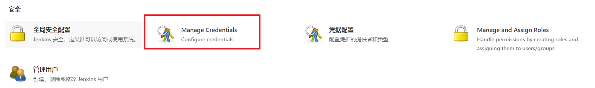

# Jenkins 持续集成

## 持续集成及Jenkins介绍

### 软件开发生命周期

软件开发生命周期又叫做 SDLC, 它是集合了计划，开发，测试和部署过程的集合，如下图所示


- 需求分析：根据项目需求，执行一个可行性计划的分析，这阶段主要是对项目信息的收集，分析项目的预算，以及收益情况，明确项目创建的目标
- 设计：主要是设计系统的架构和整个系统最后出来需要什么功能
- 实现：开发者根据任务和在设计阶段确定的目标进行代码开发
- 测试：包括功能测试，代码测试，压力测试等
- 进化(维护)：对产品不断的进行改进和维护，根据用户的使用情况和反馈，可能需要对某功能进行修改，bug修复，功能增加等

### 软件开发瀑布模型


| 优势                                 | 劣势                                                         |
| ------------------------------------ | ------------------------------------------------------------ |
| 简单易用和理解                       | 每个阶段都是固定的，会产出大量的文档，增加工作量             |
| 当完成一个阶段之后，只用关注后续阶段 | 由于开发模型是线性的，用户只有等到最后才能看到产品的最终效果，增加了成本和风险 |
| 为项目提供了按阶段划分的检查节点     | 最核心的劣势在于 **无法快速适应用户提出需求的变化**          |

### 软件敏捷开发

> 什么是敏捷开发？

敏捷开发(Agile Develop) 的核心是**迭代开发**与**增量开发**

- 迭代开发：对于大型软件项目，传统的开发方式是采用一个大周期进行开发，整个过程就是一次大开发

  迭代开发的方式则不一样，它将开发过程拆分成多个小周期，即将一次 **大开发** 拆分成 **多次小开发**，每次小开发都是一样的流程

- 增量开发：软件的每个版本，都会新增一个用户可以感知的完整功能，也就是说，按照**新增功能来划分迭代版本**

> 敏捷开发如何迭代？

虽然敏捷开发分成多个迭代，但是也要求，每次迭代都是一个**完整的软件开发周期**


> 敏捷开发的好处

- 早期交付：降低成本
- 降低风险：可以即使了解市场需求，降低产品不适用的风险

### 持续集成

> 敏捷开发的好搭档

持续集成(CI)指的是，频繁的(一天多次)将代码集成到主干

持续集成的目的就是：**让产品可以快速迭代，同时还能保证高质量**；核心措施就是代码集成到主干后，必须通过自动化测试，只要有一个测试用例失败，就不能集成

> 持续集成的流程

- 提交：流程的第一步，开发者想代码仓库提交代码
- 测试(第一轮)：代码仓库对 commit 操作配置了钩子(hook), 只要代码提交或者合并到主干，就会进行自动化测试
- 构建：通过第一轮测试后，代码就可以合并到主干，就算可以交付了。而构建指的是，**将源码转为可以运行的实际代码**(例如安装依赖，配置各种资源等等)
- 测试(第二轮)：构建之后，如果第一轮已经覆盖了所有测试内容，第二轮就可以省略，当前，这时构建步骤就需要移动到第一轮测试前面
- 部署：通过第二轮测试，当前代码就是一个可以直接部署的版本，将这个版本的所有文件打包存档，发送生产服务器
- 回滚(支持自动回滚)：一旦当前版本发生问题，就要回滚到上一个版本的构建结果

> 持续集成的组成要素

- 一个**自动构建过程**，从构建代码，编译构建，运行测试，结果记录，测试统计都是自动完成的，无需人工干预
- 一个**代码存储库**，即需要版本控制软件来保证代码的可维护性，同时作为构建过程的素材库，一般使用 SVN / GIT
- 一个**持续集成服务器**，而 **Jenkins** 就是一个配置简单和使用方便持续集成服务器

> 持续集成的好处

1. 降低风险，由于持续集成会自动的不断的进行构建，编译和测试；可以很早期的发现问题，减小修复的代价
2. 对系统健康持续检查，减少发布风险带来的问题
3. 减少重复性的工作
4. **持续部署**，提供可部署单元包
5. 持续交付可供使用的版本

### Jenkins 介绍


官网：https://www.jenkins.io/zh/

简介：是一款流行的开源的**持续集成(CI)工具**,广泛用于项目开发，具有自动化构建，测试和部署等功能

特征：


## Jenkins 安装和持续集成环境配置

### 持续集成流程说明


1. 开发人员进行 commit 将代码提交到 git 仓库
2. Jenkins 作为持续集成工具，使用 git 工具到 git 仓库拉取代码到集成服务器，再配合 JDK, Maven 等软件完成代码编译，代码测试，审查，打包等工作；(在这个过程中每一步出错，都重新执行一次整个流程)
3. Jenkins 将打包的 war / jar 包分发到测试服务器/生产服务器，供测试人员/用户访问

### Gitlab 代码托管仓库服务器

#### 安装

1. 安装相关依赖

   ```bash
   yum -y install policycoreutils openssh-server openssh-clients postfix
   ```

2. 启动 ssh 服务 & 并设置开机自启

   ```bash
   systemctl enable sshd && sudo systemctl start sshd
   ```

3. 设置 postfix 开机自启(用来支持 gitlab 发信功能)

   ```bash
   systemctl enable postfix && systemctl start postfix
   ```

4. 开放 ssh 以及 http 服务，然后重新加载防火墙列表(也可以直接关闭防火墙)

   ```bash
   firewall-cmd --add-service=ssh --permanent
   firewall-cmd --add-service=http --permanent
   firewall-cmd --reload
   ```

5. 下载 [gitlab](https://mirrors.tuna.tsinghua.edu.cn/gitlab-ce/yum/el6/gitlab-ce-12.4.2-ce.0.el6.x86_64.rpm) 进行安装

   ```bash
   rpm -i gitlab-ce-12.4.2-ce.0.el6.x86_64.rpm
   ```

6. 修改 gitlab 配置

   ```bash
   vi /etc/gitlab/gitlab.rb
   ```

   主要是修改 gitlab 访问地址和端口

   访问地址是默认有的，要去修改; nginx那个可以直接写，默认是注释的

   ```ruby
   external_url 'http://192.168.66.100:82'
   nginx['listen_port'] = 82
   ```

7. 重新加载配置以及重启 gitlab(需要等一会)

   ```bash
   gitlab-ctl reconfigure
   gitlab-ctl restart
   ```

8. 开放对应的端口[如果关闭防火墙了那无所谓]

   ```bash
   firewall-cmd --zone=public --add-port=82/tcp --permanent
   firewall-cmd --reload
   ```

9. 启动，访问

   

   

#### 添加组，创建用户，创建项目

1. 创建组

   使用管理员 root 创建组，一个组里面可以有多个项目，可以将开发者添加到组里面并进行相关权限设置

   

   

2. 创建用户

   

   需要注意的点：

   - 分配身份权限

     

   - 密码：需要创建用户后才能设置(可以在右上角退出登录试试)

     

     

3. 将用户添加到用户组中

   

   

   

   Guest：可以创建 issue，发布评论，不能读写版本库

   Reporter：可以克隆代码，不能提交

   Developer：可以克隆代码，开发，提交，push

   Maintainer：可以创建项目，项目 tag，保护分支，添加项目成员，边际成员

   Owner：可以设置项目访问权限，删除项目，迁移项目，管理组成员

4. 创建项目

   

#### 将代码提交到 gitlab 仓库

就和正常上传到 git 一样，地址可以在仓库的左上角 [Clone] 上搞到，不过第一次上传的时候 need 输入账号密码，输入自己 gitlab 的账户即可(建议用 root 不然可能遇到权限问题emmm)


### Jenkins 安装

1. 安装 JDK 环境

   ```bash
   yum install java-1.8.0-openjdk* -y
   ```

2. 进行 Jenkins 安装

   ```bash
   sudo wget -O /etc/yum.repos.d/jenkins.repo https://pkg.jenkins.io/redhat-stable/jenkins.repo
   sudo rpm --import https://pkg.jenkins.io/redhat-stable/jenkins.io.key
   yum install jenkins
   ```

   如果第一条命令出现错误，就换成

   ```bash
   wget --no-check-certificate -O /etc/yum.repos.d/jenkins.repo https://pkg.jenkins.io/redhat-stable/jenkins.repo
   ```

3. 启动 Jenkins

   ```bash
   systemctl start jenkins
   ```

4. 修改 Jenkins 配置(改完记得重启)

   ```bash
   vi /etc/sysconfig/jenkins
   ```

   修改内容

   ```
   JENKINS_USER="root"
   JENKINS_PORT="8888"
   ```

   [坑]如果修改之后发现 Jenkins 的端口依然是 8080，可以使用以下方法

   ```bash
   vim /usr/lib/systemd/system/jenkins.service
   ```

   > Environment="JENKINS_PORT=8888"

   ```bash
   # 重新加载配置文件
   systemctl daemon-reload
   ```

5. 打开游览器访问(记得开放对应的端口)

6. 获取并输入 admin 密码

   ```bash
   cat /var/lib/jenkins/secrets/initialAdminPassword
   ```

7. 跳过插件安装(因为 Jenkins 插件需要连接官网下载，速度太慢，所以这里先暂时跳过)

   

   

8. [可选]创建一个管理员账户

   

### Jenkins 插件安装

#### 修改 Jenkins 插件下载地址

1. 打开 Jenkins；jenkins -> Manage jenkins -> Maven Plugins，点击 Available

2. 等待列表加载完成，这一步是为了将 Jenkins 官方的插件列表下载到本地

3. 修改地址文件，替换为国内插件地址

   ```bash
   cd /var/lib/jenkins/updates
   
   sed -i 's/http:\/\/updates.jenkinsci.org\/download/https:\/\/mirrors.tuna.tsinghua.edu.cn\/jenkins/g' default.json && sed -i 's/http:\/\/www.google.com/https:\/\/www.baidu.com/g' default.json
   ```

4. 在 Plugin Manager 中点击 Advance，划到最下面 Update Site 将其中的 URL 修改成国内的下载地址

   > https://mirrors.tuna.tsinghua.edu.cn/jenkins/updates/update-center.json

   点击 Submit

5. 在 Jenkins 访问地址后面加上 `/restart`，即可重启 Jenkins

   

#### 安装中文插件

1. Manager Jenkins -> Manage Plugins -> Available 等待列表下载完成

2. 输入 `Chinese`

   

3. 等待安装后勾选重启框即可

   

4. 刷新页面

### Jenkins 用户权限管理

> 利用 Role-based Authorization Strategy 管理 Jenkins 用户

1. 系统管理 -> 插件管理 -> 可选插件，等待列表加载完成

2. 搜索 [Role-based Authorization Strategy]

   

3. 等待安装，这个可以不用重启

4. 系统管理 -> 全局安全配置 -> 授权策略

   

5. [创建角色] 系统管理 -> Manage and Assign Roles -> 管理角色

   

   下面有个 **Save** 别忘了保存

6. [创建用户] 系统管理 -> 管理用户

   

7. [给用户分配角色] 系统管理 -> Manage and Assign Roles -> Assign Roles(记得下面有个 **Save**)

   

8. [创建项目用来测试] 新建任务

   

   

9. 分别使用两个账户登录

   

   

### Jenkins 凭证管理

作用：凭据可以用来存储需要密文保护的数据库密码、Gitlab密码信息、Docker私有仓库密码等，以便 Jenkins可以和这些第三方的应用进行交互

#### 安装 Credentials Binding 插件


安装成功后可以在 系统管理 中看到相关选项


#### 安装 git 插件 & git 工具

作用：为了让Jenkins支持从Gitlab拉取源码，需要安装Git插件以及在CentOS7上安装Git工具。

> git 插件安装


在安装完成后可以[新建任务]并在其中的**源码管理**中可以看到 git


> 在 Centos 中安装 git

```bash
yum install git -y #安装
git --version      #安装后查看版本
```

#### 使用用户密码类型拉取 gitlab 仓库

1. [凭据配置]

   

   

2. 添加凭据

   

   

3. 选择凭据类型并填写相关数据

   

   

4. [测试凭证是否可以使用] 打开任务 -> 配置 -> 源码管理(记得点 Save)

   

5. 回到任务界面，点击[立即构建]，等待一会，点击[工作区]即可看到拉取的代码

   

#### 使用 SSH 密钥拉取 gitlab 仓库

> SSH 免密登录示意图


1. 使用 root 用户生成公钥和私钥

   ```bash
   ssh-keygen -t rsa
   ```

2. 可以在 `/root/.ssh` 下查看公钥私钥文件

   

3. 复制公钥放到 gitlab 上

   

4. 在 Jenkins 中添加密钥凭证

   

5. 使用密钥凭证拉取 gitlab 仓库上的数据

   

6. [立即构建]

   

### Maven 安装和配置

> 在 Jenkins 服务器上，我们需要安装 Maven 来编译和打包项目

#### 安装 Maven

1. 先将 Maven 软件上传到服务器

2. 解压 Maven 文件夹

   ```bash
   tar -xzf apache-maven-3.6.2-bin.tar.gz #解压
   mkdir -p /opt/maven 				   #创建目录
   mv apache-maven-3.6.2/* /opt/maven     #移动文件
   ```

3. 配置环境变量

   ```bash
   vi /etc/profile
   ```

   > export JAVA_HOME=/usr/lib/jvm/java-1.8.0-openjdk 
   >
   > export MAVEN_HOME=/opt/maven 
   >
   > export PATH=$PATH:$JAVA_HOME/bin:$MAVEN_HOME/bin

   ```bash
   source /etc/profile #配置生效
   mvn -v 				#查找Maven版本
   ```

#### 修改 Maven 的 setting.xml

1. 创建本地仓库目录

   ```bash
   mkdir /opt/resp
   ```

2. 修改 maven 配置文件

   ```bash
   vi /opt/maven/conf/settings.xml
   ```

   ```xml
   <!-- 这一段可以直接加 -->
   <localRepository>/opt/resp</localRepository>
   <!-- 这一段在 mirrors 中添加 -->
   <mirror>
       <id>aliyunmaven</id>
       <mirrorOf>*</mirrorOf>
       <name>阿里云公共仓库</name>
       <url>https://maven.aliyun.com/repository/public</url>
   </mirror>
   ```

#### 在 Jenkins 上配置 JDK & Maven

系统管理 -> 全局工具配置


记得点击 **保存**

#### 添加 Jenkins 全局配置

系统管理 -> 系统配置 -> 全局属性


#### 测试 Maven 是否配置成功

打开一个任务，点击[配置]，找到[构建] -> [增加构建步骤] -> [执行 shell]

```shell
mvn clean package
```

点击保存后，点击[立即构建]

tips：如果出现错误可以参考

- https://blog.csdn.net/qq_34794527/article/details/117363051
- https://blog.csdn.net/luomo0203/article/details/110414085

### Tomcat 安装和配置

1. 安装 JDK

   ```bash
   yum install java-1.8.0-openjdk* -y
   ```

2. 将对应的 tomcat 上传的服务器上并解压

3. 创建一个目录用来存放 tomcat

   ```bash
   mkdir -p /opt/tomcat
   ```

4. 移动 tomcat 到目的文件夹

   ```bash
   mv apache-tomcat-8.5.78/* /opt/tomcat/
   ```

5. 默认情况下 tomcat 没有角色维护管理，所以需要额外配置

   ```bash
   vi /opt/tomcat/conf/tomcat-users.xml
   ```

   ```xml
   <!-- 配置角色 -->
   <role rolename="tomcat"/>
   <role rolename="role1"/>
   <role rolename="manager-script"/>
   <role rolename="manager-gui"/>
   <role rolename="manager-status"/>
   <role rolename="admin-gui"/>
   <role rolename="admin-script"/>
   <!-- 配置用户并分配角色 -->
   <user username="tomcat" password="tomcat" roles="manager-gui,managerscript,tomcat,admin-gui,admin-script"/>
   ```

   ```bash
   vi /opt/tomcat/webapps/manager/META-INF/context.xml
   ```

   ```xml
   <!-- 将这部分内容注释dio即可 -->
   <!--
   <Valve className="org.apache.catalina.valves.RemoteAddrValve"
   allow="127\.\d+\.\d+\.\d+|::1|0:0:0:0:0:0:0:1" />
   -->
   ```

6. 运行 tomcat

   ```bash
   /opt/tomcat/bin/startup.sh
   ```

7. 访问对应的 8080 端口

   
   输入对应的用户密码(tomcat)即可访问管理界面


